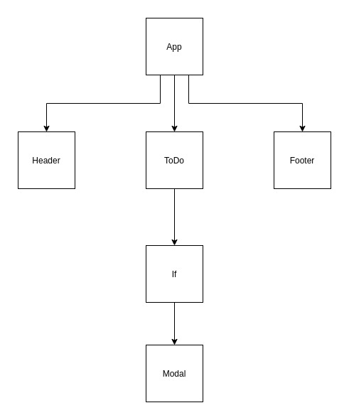

# LAB - 401-lab-31

## Hooks

### Author: Travis Skyles

### Links and Resources

- [submission PR](http://xyz.com)
- [travis](http://xyz.com)
  <!-- * [front-end](http://xyz.com) (when applicable) -->
- [codesandbox.io](https://codesandbox.io/s/lab-31-starter-code-w6ljc)

### Setup

- `clone repo to local`
- `open in editor`
- `npm i`
- `npm start`

#### Tests

- `npm test`

#### UML

